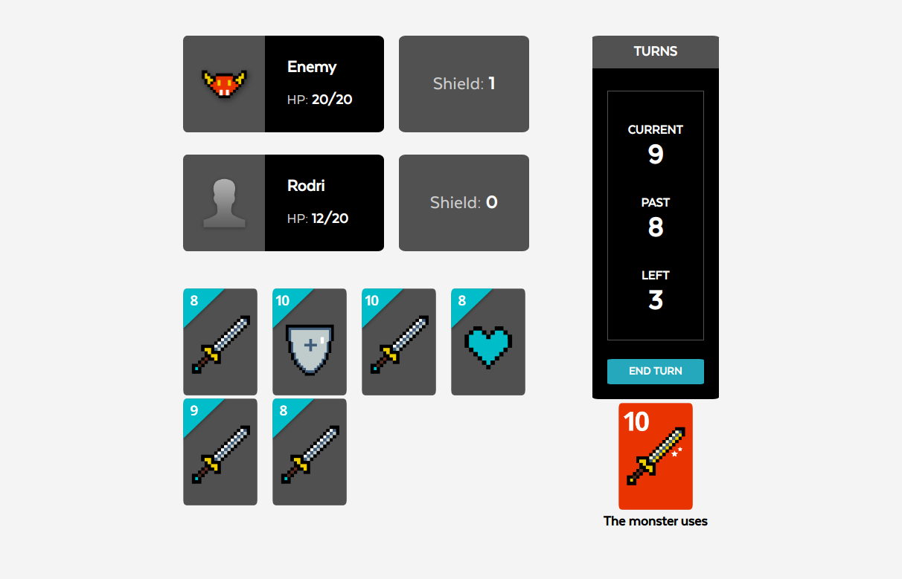

# Card Game

## Game rules

Each turn the player must draw a new card and play another one.  
To win the game, you must kill the monster before you run out of turns or health points.‍

<ins>Max turns</ins>: 16

<ins>Effects</ins>:  
* Heal: increase the hp of the entity (user or monster)  
* Shield: increase the shield of the entity (user or monster)  
* Damage: decrease the hp or shield (if is not 0) of the opponent  
* Horror: the opponent lost the turn (only the monster has this card)  

Take advantage of your cards! They are higher than the monster's  
Have fun!

## Next Steps
* Search for Apollo cache policies in order to leverage its potential
* Handle cardWasNotPlayedError from Backend if player do not pick any card when he should
* Authenticate routes so the player can only go to /
* Validate player's name is not empty
* Use some kind of animation to show the player what happened immediately after his turn
* Make the game responsive

## Getting Started

### Installing

Get the latest version of node from the [official website](https://nodejs.org/) or using [nvm](https://github.com/creationix/nvm).  
Nvm approach is preferred.

Install dependencies by running `npm i`.

To start the app run:  
`REACT_APP_GAME_BASE_URL=http://localhost:8080 npm start`  
By default [GraphQL](https://github.com/raparicio6/card-game-graphql) uses *http://localhost:8080* as the base url. Before running the app, make sure you have GraphQL running along with [Backend](https://github.com/raparicio6/card-game-node).

### Only building

To only build the application in a specific env, run:  
`npm run build environment`

## Development

### Testing

In order to execute the tests run `npm test`.  
[Jest](https://jestjs.io/) was used as the testing framework along with [Enzyme](https://airbnb.io/enzyme/).

## Built With

* [React](https://reactjs.org/)
* [Apollo](https://www.apollographql.com/docs/react/)
* [SASS](https://sass-lang.com/)
* [CircleCI](https://circleci.com/)

## Contributing

1. Fork it
2. Create your feature branch (`git checkout -b my-new-feature`)
3. Run the tests (`npm test`)
4. Commit your changes (`git commit -am 'Add some feature'`)
5. Push to the branch (`git push origin my-new-feature`)
6. Create new Pull Request

## About

This project was written and is maintained by [Rodrigo Aparicio](https://github.com/raparicio6).

## License

This project is licensed under the MIT License.
